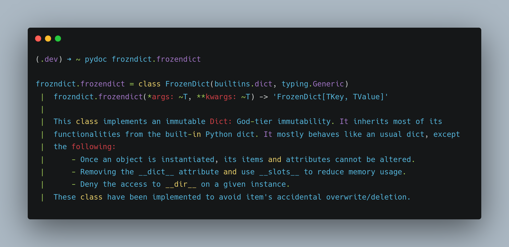

=========
frozndict
=========

.. image:: https://coveralls.io/r/Harmouch101/frozndict/badge.png?branch=main
   :target: https://coveralls.io/r/Harmouch101/frozndict
   :align: left
   :alt: Coverage Report

.. image:: https://img.shields.io/badge/License-GPLv3-blue.svg
   :target: https://github.com/Harmouch101/frozndict/blob/main/LICENSE
   :align: left
   :alt: License

.. image:: https://img.shields.io/pypi/v/frozndict.svg
   :target: https://pypi.org/project/frozndict/
   :align: left
   :alt: pypi version

.. image:: https://circleci.com/gh/Harmouch101/frozndict.svg?style=shield
   :target: https://circleci.com/gh/Harmouch101/frozndict
   :alt: Circle ci Build Status

.. image:: https://img.shields.io/github/repo-size/Harmouch101/frozndict
   :target: https://github.com/Harmouch101/frozndict/
   :align: left
   :alt: Repo Size

**frozndict** is a python package that acts as an alternative to frozenset, but for dictionaries.

🛠️ Requirements
---------------

**frozndict** requires Python 3.9 or above.

To install Python 3.9, I recommend using `pyenv`_.

.. code-block:: bash

   # install pyenv
   git clone https://github.com/pyenv/pyenv ~/.pyenv

   # setup pyenv (you should also put these three lines in .bashrc or similar)
   # if you are using zsh
   cat << EOF >> ~/.zshrc
   # pyenv config
   export PATH="${HOME}/.pyenv/bin:${PATH}"
   export PYENV_ROOT="${HOME}/.pyenv"
   eval "$(pyenv init -)"
   EOF

   # or if you using the default bash shell, do this instead:
   cat << EOF >> ~/.bashrc
   # pyenv config
   export PATH="${HOME}/.pyenv/bin:${PATH}"
   export PYENV_ROOT="${HOME}/.pyenv"
   eval "$(pyenv init -)"
   EOF
   # Close and open a new shell session
   # install Python 3.9.10
   pyenv install 3.9.10

   # make it available globally
   pyenv global system 3.9.10

To manage the Python 3.9 virtualenv, I recommend using `poetry`_.

.. code-block:: bash

   # install poetry
   curl -sSL https://install.python-poetry.org | python3 -
   poetry --version
   Poetry version 1.1.13

   # Having the python executable in your PATH, you can use it:
   poetry env use 3.9.10

   # However, you are most likely to get the following issue:
   Creating virtualenv frozndict-dxc671ba-py3.9 in ~/.cache/pypoetry/virtualenvs

   ModuleNotFoundError

   No module named 'virtualenv.seed.via_app_data'

   at <frozen importlib._bootstrap>:973 in _find_and_load_unlocked

   # To resolve it, you need to reinstall virtualenv through pip
   sudo apt remove --purge python3-virtualenv virtualenv
   python3 -m pip install -U virtualenv

   # Now, you can just use the minor Python version in this case:
   poetry env use 3.9.10
   Using virtualenv: ~/.cache/pypoetry/virtualenvs/frozndict-dxc671ba-py3.9

🚨 Installation
---------------

With :code:`pip`:

.. code-block:: console

   python3.9 -m pip install frozndict

With `pipx`_:

.. code-block:: console

   python3.9 -m pip install --user pipx
   pipx install --python python3.9 frozndict

🚸 Usage
--------

.. code-block:: python3

   >>> from frozndict import frozendict

   # Empty immutable immutable dictionary.
   >>> frozen_dict = frozendict({})
   frozendict({})

   # Non empty immutable immutable dictionary.
   >>> frozen_dict = frozendict({"Greetings": "Hello World!"})
   >>> frozen_dict
   frozendict({'Greetings': 'Hello World!'})

   # Get an item.
   >>> frozen_dict["Greetings"]
   'Hello World!'

   # Copy a dictionary.
   >>> frozen_dict_copy = frozen_dict.copy()
   >>> frozen_dict_copy
   {'Greetings': 'Hello World!'}

   # Nested dictionary.
   >>> frozen_dict_copy = frozendict({'x': 3, 'y': 4, 'z': {'a': 0, 'b': [3,1,{4,1},[5,9]]}}, c= 1)
   >>> print(a.pretty_repr())
   frozendict({
       x: 3,
       y: 4,
       z: {
           a: 0,
           b: [3, 1, {1, 4}, [5, 9]],
       },
       c: 1,
   })

   # Create an immutable dictionary using `fromkeys` method.
   >>> frozen_dict = frozendict.fromkeys(["x", "y"], "5")
   >>> frozen_dict
   frozendict({'x': '5', 'y': '5'})

   # Test uniqueness: frozendict(a=1,b=2) == frozendict(b=2,a=1)
   >>> set([frozendict(a=1,b=2), frozendict(a=5), frozendict(b=2,a=1)])
   {frozendict({'a': 5}), frozendict({'a': 1, 'b': 2})}

🚀 Similar Projects Comparaison
-------------------------------

This project is similar to `frozendict`_ created by `Marco Sulla`_.

.. code-block:: python3

   >>> from frozndict import frozendict as myfrozendict
   >>> from frozendict import frozendict

   # create instances
   >>> my_frozen_dict = myfrozendict({'x': 3, 'y': 4, 'z': {'a': 0, 'b': [3,1,{4,1},[5,9]]}}, c= 1)
   >>> frozen_dict = frozendict({'x': 3, 'y': 4, 'z': {'a': 0, 'b': [3,1,{4,1},[5,9]]}}, c= 1)
   >>> dict = dict({'x': 3, 'y': 4, 'z': {'a': 0, 'b': [3,1,{4,1},[5,9]]}}, c= 1)

   # comparaison
   >>> import sys
   >>> tuple(map(sys.getsizeof, [frozen_dict, my_frozen_dict, dict]))
   (248, 240, 232)

Notice :code:`my_frozen_dict` takes less space in memory than :code:`frozen_dict`!

🎉 Credits
----------

These following projects were used to build and test :code:`frozndict`.

- `python`_
- `poetry`_
- `pytest`_
- `flake8`_
- `coverage`_
- `rstcheck`_
- `mypy`_
- `pytestcov`_
- `tox`_
- `isort`_
- `black`_
- `precommit`_

👋 Contribute
-------------

If you are looking for a way to contribute to the project, please refer to the `Guideline`_.

📝 License
----------

This program and the accompanying materials are made available under the terms and conditions of the `GNU GENERAL PUBLIC LICENSE`_.

.. _GNU GENERAL PUBLIC LICENSE: http://www.gnu.org/licenses/
.. _frozendict: https://pypi.org/project/frozendict/
.. _Marco Sulla: https://github.com/Marco-Sulla
.. _Guideline: https://github.com/Harmouch101/frozndict/blob/main/CONTRIBUTING.rst
.. _pyenv: https://github.com/pyenv/pyenv
.. _poetry: https://github.com/python-poetry/poetry
.. _pipx: https://github.com/pypa/pipx
.. _python: https://www.python.org/
.. _pytest: https://docs.pytest.org/en/7.1.x/
.. _flake8: https://flake8.pycqa.org/en/latest/
.. _coverage: https://coverage.readthedocs.io/en/6.3.2/
.. _rstcheck: https://pypi.org/project/rstcheck/
.. _mypy: https://mypy.readthedocs.io/en/stable/
.. _pytestcov: https://pytest-cov.readthedocs.io/en/latest/
.. _tox: https://tox.wiki/en/latest/
.. _isort: https://github.com/PyCQA/isort
.. _black: https://black.readthedocs.io/en/stable/
.. _precommit: https://pre-commit.com/
